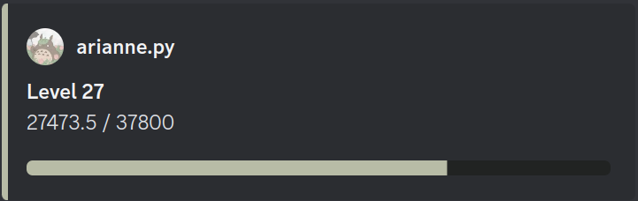

A Discord bot made with [Discord.js](https://discord.js.org/#/).

## Levels system
### Commands
#### /profile [user: @mention]
View your profile or the mentionned user's profile.


#### /ephemeral
Enable or disable ephemeral mode. This mode makes all interactions with the bot hidden from other users.

#### /setcolor [hexcode*: #FFFFFF]
Set the color of your profile to a specific HEX code.

### Formula
experienceToNextLevel = (currentLevel * nextLevel) * 50

### Configuration
```json
src/config/chatting.json
{
    "chattingExpMultiplier": 1.00,
    "chattingExpDelayInSeconds": 60,
    "chattingExpMinGain": 120,
    "chattingExpMaxGain": 300
}
```

## Setting up
Create `src/config/config.json`
```json
{
    "token": "YOUR_BOT_TOKEN",
    "clientId": "YOUR_BOT_CLIENT_ID"
}
```

## Deployment
Deployed with Docker Compose:

*Check Dockerfile and docker-compose.yml*

Here are the containers:
- The bot
- A local MongoDB database
- [mongo-express](https://github.com/mongo-express/mongo-express) (web interface for MongoDB)

### Start

`$ sudo docker compose up`

## Backing up data
`$ docker exec -it mongo bash`

### Export
`$ mongoexport --db bloometti --port 27017 --collection users --out=users.json`

### Import
`$ mongoimport --db bloometti --port 27017 --collection users --file users.json`

*users.json will be located in `data/mongo`

## Dependencies
- [Discord.JS](https://www.npmjs.com/package/discord.js) (v14.15.2)
- [Canvas](https://www.npmjs.com/package/canvas) (v2.11.2) (Image Manipulation)
- [MongoDB](https://www.npmjs.com/package/mongodb) (v6.6.2)