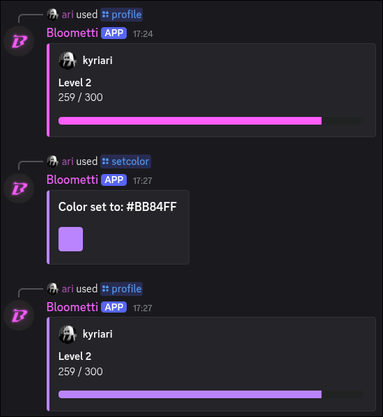

A Discord bot made with [Discord.js](https://discord.js.org/#/) that adds a levels system to Discord!
It provides configuration through JSON files and the Mongo Express web-based admin interface for MongoDB.
Easy deployment is made possible through either Docker Compose or Kubernetes.

## In action


## Commands
### /profile [user: @mention]
View your profile or the mentionned user's profile.
### /ephemeral
Toggle ephemeral mode. This mode makes all your interactions with the bot hidden from other users.
### /setcolor [hexcode*: #FFFFFF]
Set the color of your profile to a specific HEX code.

## Formula
experienceToNextLevel = (currentLevel * nextLevel) * 50

## Configuration
src/config/chatting.json
```json
{
    "chattingExpMultiplier": 1.00,
    "chattingExpDelayInSeconds": 60,
    "chattingExpMinGain": 120,
    "chattingExpMaxGain": 300
}
```
src/config/defaults.json
```json
{
    "defaultColor": "#ff5dfd",
    "defaultEphemeral": false
}
```

## Setting up
Create `src/config/config.json`
```json
{
    "token": "YOUR_BOT_TOKEN",
    "logsWebhookUrl": "YOUR_LOGS_DISCORD_WEBHOOK",
    "clientId": "YOUR_BOT_CLIENT_ID",
    "guildId": "YOUR_BOT_GUILD_ID",
}
```

Execute `commands_management/deploy-commands-globally.js` to deploy commands.

## Deployment

Here are the containers:
- The bot
- A local MongoDB database
- [mongo-express](https://github.com/mongo-express/mongo-express) (web interface for MongoDB) available on port 8081

### Docker Compose

#### Start
```
$ docker compose up
```

#### Stop
```
$ docker compose down
```

#### Rebuilding
```
$ docker compose down
$ docker image remove bloometti-bot
or to remove everything:
$ docker compose down --rmi all

then
$ docker compose up --build
```

#### Backing up data
```
$ docker exec -it mongo bash
$ cd data/db
```
#### Export/Import
**users.json will be located in `data/mongo` on the host system**
```
$ mongoexport --db bloometti --port 27017 --collection users --out=users.json
```
```
$ mongoimport --db bloometti --port 27017 --collection users --file users.json
```

### Kubernetes

```
$ kubectl apply -f deployment/k8s
```

You must provide the persistent volume for the MongoDB database.
